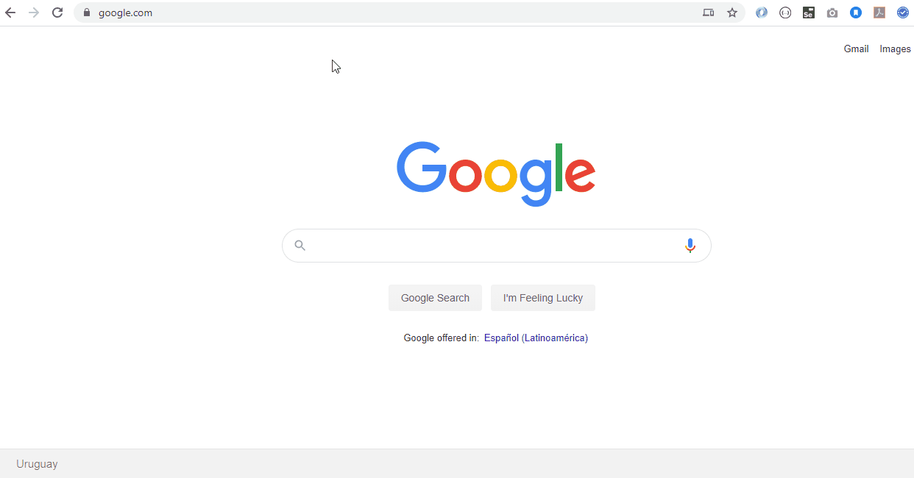

# Salesforce integration example (oauth2 web-server flow)

Spring boot application to obtain a salesforce access token using [Salesforce REST API](https://developer.salesforce.com/docs/atlas.en-us.api_rest.meta/api_rest/quickstart_oauth.htm). Check [how apps are authenticated using the web server flow](https://developer.salesforce.com/docs/atlas.en-us.api_rest.meta/api_rest/intro_understanding_web_server_oauth_flow.htm).


## Prerequisites

1- [Obtain a salesforce developer edition](https://developer.salesforce.com/signup)

2- [Create a connected app](https://help.salesforce.com/articleView?id=connected_app_create.htm): 

- From Setup, enter Apps in the Quick Find box, and select App Manager.
- Click New Connected App.
- Enter the connected app’s name, which displays in the App Manager and on its App Launcher tile. The connected app name must be unique within your org. If the connected app was created in the Spring ‘14 release or later, you can reuse the name of a deleted connected app.
- Click Enable OAuth Settings and specify your callback URL and OAuth scopes. The Callback URL you supply here is the same as your application’s callback. It must be secured. For development environments, the callback URL is similar to https://localhost:8443/...


## Run locally
Download or clone the project
```bash
git clone ... 
```

Add your org's version, connected app client id and secret to the application properties file:
```bash
#consumer key
security.oauth2.client.client-id = CONNECTED_APP_CLIENT_ID

#consumer secret
security.oauth2.client.client-secret = CONNECTED_APP_CLIENT_SECRET

#salesforce rest version
rest-version = VERSION 
```

Start the local server via Maven
```bash
mvn spring-boot:run
```
Check out the app at http://localhost:8080



